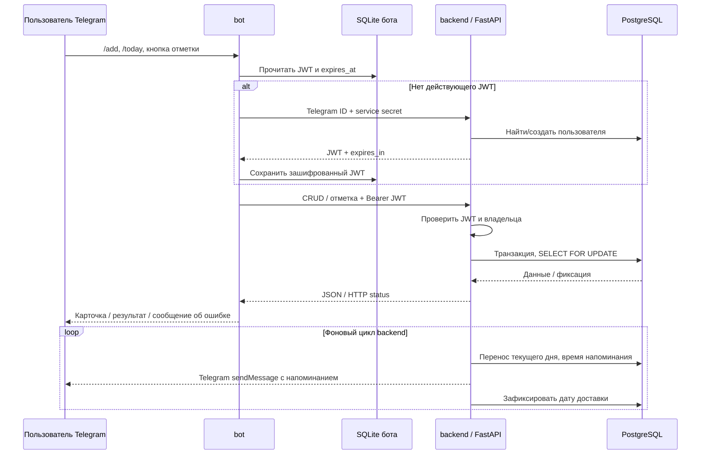

# Чат-бот для трекинга привычек

Учебный проект по приложенному ТЗ: Telegram frontend на **pyTelegramBotAPI**, backend на **FastAPI**, **PostgreSQL + SQLAlchemy + Alembic**. Два прикладных сервиса `bot` и `backend`; рядом работают PostgreSQL и одноразовый инициализатор секретов. Бот также имеет собственную SQLite-базу для зашифрованных пользовательских JWT. Зависимости управляются Poetry и зафиксированы в `poetry.lock`.

## Быстрый запуск

Нужны Docker Desktop (Linux containers) или Docker Engine и Docker Compose. Docker должен быть запущен.

1. Скачайте проект и откройте терминал в папке с `docker-compose.yml`.
2. Скопируйте `.env.example` в `.env`:
   - Windows PowerShell: `Copy-Item .env.example .env`
   - Linux/macOS: `cp .env.example .env`
3. В Telegram откройте **@BotFather**, отправьте `/newbot`, задайте имя и username бота. Полученный token вставьте в `.env` вместо `replace-with-your-botfather-token`:
   ```dotenv
   TELEGRAM_BOT_TOKEN=ваш_настоящий_токен
   HABIT_COMPLETION_LIMIT=21
   ```
4. Запустите одной командой:
   ```sh
   docker-compose up
   ```
   Современный эквивалент: `docker compose up`. Для фонового запуска: `docker compose up -d --build`.
5. Откройте своего бота и отправьте `/start`, затем `/add`.

При первом запуске Compose собирает образы, генерирует случайные секреты, запускает PostgreSQL, применяет миграции и запускает API и бота. Ручное создание таблиц не требуется. Боту нужен настоящий token; без него бот сообщает о необходимости настройки и перезапускается. Пользователь должен первым открыть чат с ботом: Telegram запрещает ботам начинать переписку.

Если порт 8000 занят, задайте `BACKEND_PORT=18080` в `.env`.

API: http://localhost:8000/docs. Healthcheck: http://localhost:8000/health/ready. PostgreSQL не публикует порт на хост. API публикуется только на `127.0.0.1`.

## Работа с ботом

| Команда | Действие |
|---|---|
| `/start`, `/help` | Справка |
| `/add` | Название → описание → дата начала → дата окончания |
| `/today` | Привычки текущего дня |
| `/all` | Все привычки, включая будущие и освоенные |
| `/reminder` | Время HH:MM → часовой пояс IANA → включение/выключение |
| `/cancel` | Отмена текущего диалога |

Под каждой карточкой: **Выполнено**, **Не выполнено**, **Изменить**, **История**, **Удалить**. Удаление подтверждается отдельной кнопкой и удаляет историю этой привычки. Редактирование позволяет заменить все поля. Даты вводятся как `YYYY-MM-DD`; для начала можно ввести `сегодня`, для описания и даты окончания — `-`. Если диалог прерван, `/cancel` позволяет начать заново. Незавершённые диалоги истекают через 15 минут и после перезапуска бота; сохранённые привычки остаются в PostgreSQL.

По умолчанию напоминание приходит в 20:00 **Europe/Moscow**. Измените это через `/reminder`; например, `Asia/Yekaterinburg`, `Europe/Berlin`, `America/New_York`. В базе время хранится как локальное время пользователя, а расчёты используют IANA timezone с сезонными переходами.

## Правила трекинга

- Начальная и конечная даты включительны. Будущие привычки видны в `/all`.
- Для каждого дня есть отдельная запись: без отметки / выполнено / не выполнено.
- Число выполнений — суммарное, **не серия подряд**. Пропуск не обнуляет прогресс.
- Повторная отметка «выполнено» идемпотентна. Смена её на «не выполнено» уменьшает счётчик на один; обратная смена увеличивает на один.
- Отмечать можно только текущий день пользователя. Старая Telegram-кнопка содержит свою дату, поэтому не может случайно отметить новый день.
- Пока выполнений меньше `HABIT_COMPLETION_LIMIT`, ежедневный список переносится на следующий день с пустой отметкой. Фоновый цикл создаёт записи независимо от открытия бота, а API дополнительно делает это при чтении.
- В день последнего выполнения привычка остаётся видимой, чтобы можно было исправить отметку. Со следующего дня она исчезает из `/today`, сохраняясь в `/all` и истории. Это соответствует удалению из ежедневного списка, без потери истории.
- После простоя создаются записи текущего дня. Пропущенные во время выключения дни не заполняются выдуманными отметками.
- Изменение лимита применяется к существующим привычкам. Его увеличение может вернуть освоенные привычки в ежедневный список.
- Уведомление напоминает отметить привычки без ответа; уже отмеченные «выполнено» и «не выполнено» повторно не напоминаются. Если цикл пропустил назначенную минуту, он отправляет напоминание позже в тот же день.

## Архитектура

```text
bot/                       MVP frontend
  models/api_client.py     HTTP-клиент API, перевыпуск короткоживущих токенов
  models/token_store.py    отдельная SQLite-база зашифрованных токенов
  presenters/              диалоги и обработка действий пользователя
  views/                   тексты карточек и Telegram-клавиатуры
backend/                   MVC backend
  models/                  SQLAlchemy entities
  schemas/                 входные/выходные контракты Pydantic
  controllers/             HTTP endpoints, зависимости авторизации
  services/                бизнес-логика, JWT, перенос, уведомления
  database.py              соединения и сессии
  main.py                  приложение и жизненный цикл фонового worker
common/                    конфигурация
migrations/                Alembic migrations
scripts/                   bootstrap, запуск, healthcheck
tests/                    логика, API, безопасность, уведомления, бот
.github/workflows/ci.yml    проверка кода и PostgreSQL migrations в GitHub Actions
```

Frontend не обращается к PostgreSQL backend. Его собственная SQLite-база хранит только зашифрованные токены, Telegram ID и сроки действия. Backend обрабатывает и хранит пользователей, привычки и историю в PostgreSQL. Фоновый worker работает в backend-процессе и вызывает Telegram `sendMessage`, а интерактивные обновления получает только `bot` через long polling. Один экземпляр Telegram polling на token. Backend запускается одним Uvicorn worker; для учебной нагрузки этого достаточно.

## Аутентификация и хранение секретов

Telegram аутентифицирует отправителя обновления. Бот берёт Telegram ID только из `from_user.id`, работает только в личном чате и передаёт ID доверенному API. `/auth/telegram` требует отдельный внутренний service secret: одного Telegram ID недостаточно для выдачи JWT. Сервер проверяет service secret по **Argon2id-хешу** (`pwdlib`), выдаёт JWT с `sub`, `iat`, `exp`, `iss`, `aud` и фиксированным алгоритмом HS256. Все операции с привычкой ограничены её владельцем; подмена ID возвращает 404.

Пароли пользователей не запрашиваются и не хранятся: применяется Telegram + token-аутентификация. Проверяемый пароль внутренней службы хранится на стороне авторизации как Argon2id-хеш; исходный service secret нужен боту как машинный credential. PostgreSQL использует SCRAM для хранения проверочного пароля. Исходные машинные credentials необходимы клиентам для подключения и находятся только в закрытом Docker volume `runtime_secrets`, а Telegram token — в игнорируемом Git файле `.env`/окружении. Эти файлы не входят в репозиторий или архив. Не передавайте их посторонним.

JWT secret, service secret и PostgreSQL password генерируются криптографически случайно при первом запуске и сохраняются между перезапусками. `.env.example` содержит только placeholder. Auth headers и Telegram token не записываются в логи; HTTP-логирование отправки уведомлений отключено. Не запускайте DEBUG HTTP logging с реальными credentials.

База сериализует изменения одного пользователя через `SELECT FOR UPDATE`. Уникальность `(habit_identifier, record_date)` дополнительно защищена constraint. Фоновый worker использует `SKIP LOCKED`, чтобы пропускать занятые строки и не мешать пользовательским операциям.

При внешней публикации API поставьте TLS reverse proxy, ограничение частоты запросов и резервное копирование. Compose предназначен для локального учебного запуска. Доступ к Docker/volume даёт доступ к машинным credentials; это граница доверия окружения.

## Настройки

| Переменная | Значение по умолчанию | Назначение |
|---|---|---|
| `TELEGRAM_BOT_TOKEN` | нет | Token от BotFather |
| `HABIT_COMPLETION_LIMIT` | 21 | Лимит суммарных выполнений |
| `NOTIFICATION_POLL_SECONDS` | 15 | Период фонового цикла |
| `ACCESS_TOKEN_MINUTES` | 15 | Срок JWT |
| `BACKEND_PORT` | 8000 | Локальный порт API |
| `BOT_TOKEN_DATABASE_PATH` | `/data/tokens.sqlite3` | Путь к собственной базе токенов внутри контейнера бота |

После изменения `.env`: `docker compose up -d --force-recreate backend bot`. Для обновления кода: `docker compose up -d --build`. Секреты не перегенерируются при обычном перезапуске.

## Проверки и разработка

Нужны Python 3.12 и Poetry 2.5.1:

```sh
poetry install --no-root
poetry check --lock
poetry run ruff check .
poetry run ruff format --check .
poetry run pytest -q
```

Unit/API tests используют изолированную SQLite в памяти и Telegram mock, не требуют реального token и не затрагивают рабочую базу. PostgreSQL migration checks и отдельные concurrency tests запускаются в CI с отдельной тестовой базой. SQLite не проверяет PostgreSQL row locks, поэтому эти проверки разделены.

Просмотр состояния и логов:

```sh
docker compose ps
docker compose logs --tail=100 backend bot
docker compose exec backend alembic current
docker compose exec backend alembic check
```

Миграции применяются при старте backend. Для новой миграции при разработке настройте `DATABASE_URL` на свою PostgreSQL-базу и выполните `poetry run alembic revision --autogenerate -m "description"`, затем проверьте полученный файл. Тестовая проверка обратимости: `alembic downgrade base` → `alembic upgrade head`, **только в отдельной тестовой базе**: downgrade удаляет таблицы.

API endpoints (prefix `/api/v1`):

| Endpoint | Назначение |
|---|---|
| `POST /auth/telegram` | Telegram ID + `X-Bot-Service-Secret` → JWT |
| `GET /profile` | Часовой пояс и настройки напоминаний |
| `GET /habits?include_archive=false` | Ежедневный список; `true` — все привычки |
| `POST /habits` | Создание |
| `PUT /habits/{identifier}` | Полное редактирование |
| `DELETE /habits/{identifier}` | Удаление |
| `POST /habits/{identifier}/completion` | `completed` + `record_date` |
| `GET /habits/{identifier}/history` | Последние 100 дневных записей |
| `PUT /settings/reminder` | Время, часовой пояс и включение |

Кроме auth и health, нужен `Authorization: Bearer <JWT>`. Ручные пароли/регистрация пользователей не нужны. Подробный порядок входа в Swagger описан ниже.

## Надёжность и ограничения

PostgreSQL (`postgres_data`), SQLite бота (`bot_data`) и секреты (`runtime_secrets`) хранятся в отдельных именованных volumes. `docker compose down` останавливает приложение, сохраняя данные. Не удаляйте volumes для обычного обновления. Healthcheck API проверяет доступность таблиц и прогресс worker; healthcheck бота проверяет доступность Telegram. Контейнеры запускаются с `restart: unless-stopped`; статус unhealthy сам по себе не перезапускает контейнер, его нужно учитывать при мониторинге.

После ошибки Telegram отправка повторяется не раньше чем через 60 секунд; успешная доставка помечается в базе и не повторяется в обычных условиях. Telegram не предоставляет идемпотентный ключ для sendMessage: при сбое процесса между отправкой и фиксацией транзакции возможен повтор уведомления. Это доставка с возможными повторами, не гарантия exactly-once.

21 выполнение — условие задания, не медицинская гарантия формирования привычки. История доступна до 100 последних записей на запрос. Проект рассчитан на учебную нагрузку; для масштабирования понадобятся очередь уведомлений и отдельный worker.


## Ответы на вопросы по аутентификации

### 1. Web / Swagger

`/docs` и OpenAPI-схема доступны локально для просмотра. Доступность документации не даёт доступ к данным: защищённые endpoints используют `HTTPBearer`, а Swagger показывает схему **UserAccessToken (HTTP, bearer, JWT)** и кнопку **Authorize**.

JWT можно получить через доверенного бота. Для локальной проверки оператором предусмотрен отдельный CLI, который не требует запущенного Telegram polling и не раскрывает внутренний service secret:

```sh
# Сначала запустить backend и PostgreSQL:
docker compose up -d --build backend
# Вместо 123456789 укажите свой Telegram ID; 123456789 допустим в отдельном учебном запуске.
docker compose run --rm --no-deps bot python -m scripts.issue_swagger_token --telegram-id 123456789
```

Команда выводит **короткоживущий JWT пользователя**. Скопируйте его, откройте http://localhost:8000/docs, нажмите **Authorize**, вставьте только JWT без слова `Bearer`, нажмите **Authorize → Close**. Swagger сам добавит `Authorization: Bearer <JWT>` к запросам. Не записывайте настоящий JWT на видео; для демонстрации используйте отдельный тестовый ID и дождитесь истечения токена либо удалите тестового пользователя.

CLI доступен только оператору с доступом к Docker и runtime secrets. Он может выбрать Telegram ID — это доверенный административный инструмент для локальной отладки, а не публичная регистрация или вход по одному ID. Не публикуйте `/auth/telegram` без ограничения доступа к машинному credential. Service secret никогда не вставляется в Swagger.

Без JWT API возвращает **401**. С истёкшим/подписанным другим ключом JWT — **401**. С валидным JWT другого владельца — **404**, включая чтение истории, изменение, удаление и отметку. Backend проверяет подпись HS256, `exp`, `iat`, `iss`, `aud`, `sub` и существование пользователя. Swagger не обновляет JWT автоматически: после истечения заново выполните CLI и повторите Authorize. На стороне бота перевыпуск автоматический.

### 2. Аутентификация пользователя из Telegram-бота

1. Telegram передаёт update боту через Bot API / long polling. Бот берёт идентификатор только из `message.from_user.id` / `callback.from_user.id`; ID нельзя ввести текстом вместо своей личности.
2. Бот работает только в личном чате. Проверяется соответствие chat ID и отправителя callback.
3. При отсутствии действующего JWT бот вызывает `POST /api/v1/auth/telegram`, передаёт ID и заголовок `X-Bot-Service-Secret`.
4. Backend проверяет отдельный секрет бота по Argon2id-хешу, создаёт/находит пользователя в PostgreSQL и выдаёт его JWT. Одного Telegram ID для входа недостаточно.
5. Все CRUD-запросы идут с пользовательским Bearer JWT; server-side проверка владельца обязательна для каждой операции.

Telegram BotFather token, внутренний service secret и пользовательский JWT — **три разных credential**, с разным назначением. Они не заменяют друг друга.

### 3. Собственная база и хранение токенов в боте

Словарь в памяти заменён на отдельную **SQLite-базу `tokens.sqlite3`**, принадлежащую боту. Она находится в volume `bot_data`, а не в PostgreSQL backend. SQLAlchemy создаёт схему версии 1 при старте хранилища. Таблица `user_tokens` содержит:

| Поле | Содержание |
|---|---|
| `telegram_identifier` | Ключ владельца JWT |
| `encrypted_access_token` | Шифротекст JWT, Fernet с контролем целостности |
| `expires_at` | Момент истечения, Unix timestamp UTC |
| `updated_at` | Момент сохранения, Unix timestamp UTC |

Исходный JWT не сохраняется в SQLite в открытом виде. Ключ шифрования генерируется один раз и хранится отдельно от базы, в закрытом `runtime_secrets`; его потеря требует получения новых токенов. На Linux у каталога базы права 0700, у файла 0600; приложение работает как UID 10001. После обычного перезапуска бота база и ключ сохраняются, действующий JWT используется повторно. Просроченные записи очищаются при сохранении нового JWT. Не публикуйте database/volume backups с credentials.

JWT нужно расшифровать для отправки Bearer-заголовка, поэтому его нельзя хранить только как односторонний хеш. Хешируются проверочные пароли/секреты; пользовательские токены в боте защищаются **шифрованием**.

### 4. Обновление после истечения JWT

Перед каждым запросом бот читает `expires_at` из своей базы. Если токен отсутствует, испорчен, не расшифровывается или до истечения осталось менее 30 секунд, бот повторяет доверенную аутентификацию, получает новый JWT и атомарно заменяет запись. Используется абсолютное время UTC, поэтому проверка работает после перезапуска процесса.

Если API неожиданно вернул **401**, бот удаляет отвергнутый JWT, получает новый и повторяет исходный запрос **один раз**. Повторный 401 передаётся пользователю как ошибка сервиса; бесконечного цикла нет. Это **перевыпуск access token через доверенный bot service secret**, отдельный refresh token не используется. При недоступном backend бот сообщает об ошибке и не отправляет запрос со старым истёкшим credential.

## Четыре контейнерных сервиса и последовательность общения

| Сервис Compose | Что делает | С кем общается |
|---|---|---|
| `initialize` | Одноразово создаёт секреты, ключ шифрования и права каталогов; при обновлении сохраняет прежние секреты | Записывает только `runtime_secrets` и подготавливает `bot_data`; после успешного выполнения завершает работу |
| `database` | PostgreSQL, хранит пользователей, привычки, дневные записи | Получает пароль из secret file; принимает SQL только от backend |
| `backend` | FastAPI, выдача/проверка JWT, CRUD, отметки, перенос; внутри него фоновый worker уведомлений | SQLAlchemy → PostgreSQL; HTTP → Telegram `sendMessage` для уведомлений |
| `bot` | pyTelegramBotAPI, MVP-интерфейс, диалоги и собственная SQLite-база JWT | Telegram Bot API → updates; SQLite → JWT; HTTP → backend |

Отдельного контейнера уведомлений **нет**: он реализован как фоновый worker backend, что разрешено исходным ТЗ. Сервис аутентификации также является слоем backend. `initialize` не является сервисом уведомлений; SQLite бота — отдельная база, но не отдельный контейнер.

Порядок запуска: **initialize завершился → PostgreSQL healthy → backend применил Alembic migrations и стал ready → bot стартовал**. Далее действуют два потока:



## Краткие примеры ввода и вывода

### Telegram: создание и отметки

```text
Пользователь: /add
Бот: Введите название привычки (до 120 символов).
Пользователь: Читать книгу
Бот: Описание до 1000 символов, или - для пустого описания.
Пользователь: 10 страниц
Бот: Дата начала: YYYY-MM-DD, или сегодня.
Пользователь: сегодня
Бот: Дата окончания: YYYY-MM-DD, или - без ограничения.
Пользователь: -
Бот: Привычка сохранена.
```

Карточка содержит название, описание, период, число выполнений и статус дня. Нажатие **Выполнено** меняет число с 0 на 1; повторное нажатие оставляет 1. Нажатие **Не выполнено** меняет 1 на 0. `/all` включает будущие и освоенные привычки; **История** показывает последние 100 дней. **Изменить** повторяет диалог со всеми полями; **Удалить** требует подтверждения.

### Swagger / API: создание

Запрос с действующим JWT в Authorize:

```http
POST /api/v1/habits
Authorization: Bearer <JWT>
Content-Type: application/json

{"title":"Читать книгу","description":"10 страниц","start_date":"2026-10-05","end_date":null}
```

Пример ответа **201 Created** (identifier зависит от базы):

```json
{"title":"Читать книгу","description":"10 страниц","start_date":"2026-10-05","end_date":null,"identifier":1,"completion_count":0,"completed":null,"record_date":null,"archived":false}
```

`GET /api/v1/habits` создаёт дневную запись и возвращает список с `record_date`. Для отметки отправьте `POST /api/v1/habits/1/completion` с `{"completed":true,"record_date":"2026-10-05"}`, подставляя **текущую локальную дату пользователя**, а не копируя пример в другой день. Ответ **200**, `completion_count: 1`, `completed: true`. Повтор не увеличивает счётчик.

### Нестандартные ситуации

| Ввод / действие | Результат |
|---|---|
| Запрос без Authorization / с просроченным JWT | 401 |
| Чужой identifier с валидным JWT | 404 |
| Пустое название / end_date раньше start_date | 422; в боте подсказка исправить ввод |
| Неизвестный часовой пояс | 422; диалог бота сообщает об ошибке |
| Нажатие вчерашней Telegram-кнопки | 409, новая дата не отмечается |
| Повтор «Выполнено» | Счётчик не увеличивается второй раз |
| Достижение лимита | Со следующего дня привычки нет в `/today`, история сохранена |
| Сбой Telegram при уведомлении | Повтор не ранее чем через 60 секунд, без вывода секретов в лог |
| Перезапуск бота | JWT остаётся в его базе, проверяется срок действия |
| Повреждённый шифротекст / заменённый ключ | Старый token удаляется, бот получает новый |

## ДЕРЖИТЕ В КУРСЕ ДЕЛА

### Доработка интерфейса 06.10.2026

В `/start` доступно постоянное меню: **Сегодня**, **Добавить привычку**,
**Все привычки**, **Напоминания**, **Помощь**. Команды остаются рабочими и
регистрируются автоматически в меню Telegram при запуске бота. В диалогах
появляются кнопки **Пропустить**, **Сегодня**, **Без ограничения**,
**Отменить**, выбор распространённых часовых поясов и **Да / Нет**.
Дата окончания также принимает текст `без ограничения` или отдельный `-`.
Некорректные даты и время сопровождаются русскими подсказками, ввод можно
исправить без начала диалога заново. У удаления есть кнопка отмены.

Реальный Telegram-бот настроен и запущен. В Telegram проверены создание,
редактирование, отметки, повтор отметки и история. Следующий этап — проверка
обновлённого меню, напоминаний и общая запись Telegram/API самим пользователем.

При каждой повторной сдаче прикладывается текущий план: **реализовано / над чем работаю / что планируется**. Начальный план после замечаний от 03.10.2026: (1) README и описание четырёх сервисов, (2) постоянная база токенов бота, (3) проверки сохранения и перевыпуска JWT, (4) демонстрация Swagger/API и затем реального Telegram-интерфейса.

### Реализовано к повторной сдаче 05.10.2026

- Основные требования исходного ТЗ: Telegram MVP, FastAPI MVC, PostgreSQL + SQLAlchemy + Alembic, привычки, отметки, перенос с конфигурируемым лимитом, уведомления, Poetry, Compose, healthcheck.
- По замечаниям: собственная SQLite-база JWT бота, шифрование, срок действия и сохранение после перезапуска, автоматический перевыпуск и ограниченный повтор при 401.
- README расширен: Swagger Authorize, доверенная аутентификация бота, хранение/обновление JWT, четыре Compose-сервиса и порядок общения, примеры запросов/ответов и ошибок.
- Добавлены проверки хранения токенов, перезапуска, истечения срока, повреждения ciphertext и отсутствия бесконечного повтора.

### Над чем работаю

- Проверка обновлённого меню и реальных напоминаний; подготовка общей видеозаписи.
- API проверен в контейнерах: healthcheck, Alembic, CRUD и ошибки; 47 тестов прошли, 1 PostgreSQL-тест выполняется отдельно в CI; Ruff без ошибок.
- Подготовлены отдельный MP4 с кадрами Swagger и реальными ответами API, а также сценарий записи Telegram. MP4 является монтажом экранных кадров, не непрерывной записью полного Telegram-сценария.

### Что планируется / что нужно для финальной проверки

- Проверить в настроенном Telegram-боте новое меню и доставку напоминания.
- Записать реальное взаимодействие в Telegram: все CRUD-действия, ошибки, напоминание, перезапуск и сохранение/обновление JWT.
- Доработать проект по следующим замечаниям куратора, при каждой сдаче обновлять этот план.

Функциональность API готова к проверке. **Настоящий бот настроен; полная финальная видеодемонстрация Telegram и API ещё предстоит.** Подробный сценарий: [DEMONSTRATION.md](DEMONSTRATION.md). Видео передаётся как отдельный MP4, без ZIP/архивации; при необходимости пользователь загружает его в доступное файловое хранилище с открытой ссылкой.

## Полный цикл проверки 06.10.2026

Обработчики Telegram проверены с реальным API, PostgreSQL и отправкой сообщений
в настоящий чат: CRUD, история, отметки, повтор, отмена, ошибки и авторизация.
Подтверждены перезапуск контейнера с сохранением JWT и перевыпуск реально
просроченного JWT. Фоновое уведомление доставлено в назначенную минуту.
Изменение настроек напоминаний заново активирует доставку; сохранение тех же
настроек сохраняет защиту от повторов. Пустой список не расходует напоминание.
Перенос на следующий день и лимит проверены на тестовом пользователе с заданным
временем и откатом транзакции. 47 тестов прошли локально; отдельный PostgreSQL
тест запускается в CI.

Это проверка обработчиков и сервисов, а не запись нажатий в Telegram.
Готов [пошаговый гайд для настоящей видеозаписи](VIDEO_GUIDE.md):
каждый шаг содержит три действия и ожидаемый результат.
Пользователь самостоятельно записывает видео и отправляет куратору.
